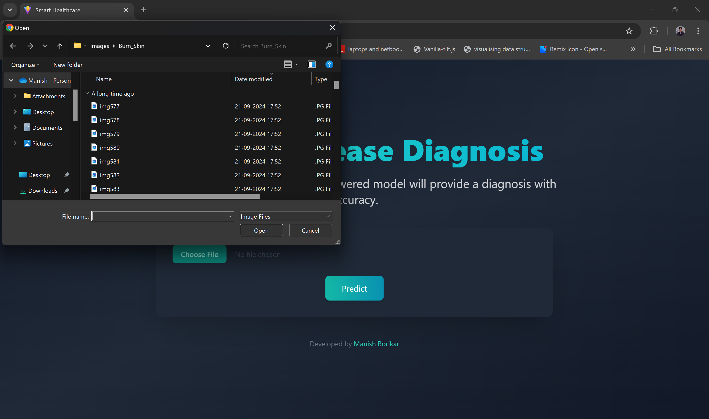
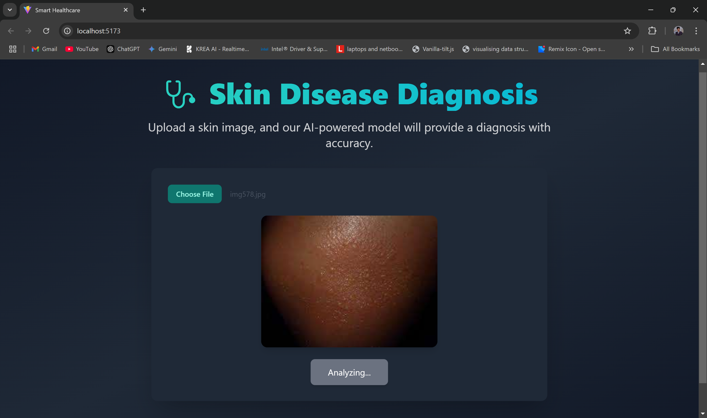
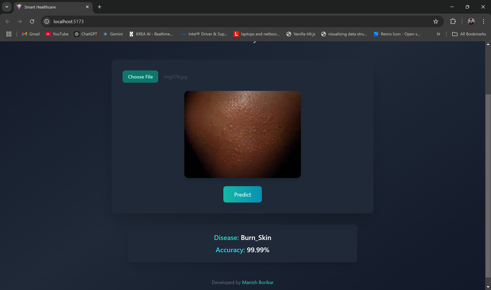

# 🩺 Smart Healthcare App

This **Smart Healthcare App** leverages a custom-trained **ResNet-50 v2** model hosted on **Hugging Face Spaces** to identify skin conditions from uploaded images. The app, built with **React** and **Vite**, provides an intuitive and responsive interface for real-time predictions.

## 🌟 Features
- **AI-Powered Predictions**: Accurately classifies skin images into five categories:
  - Burn Skin
  - Healthy Skin
  - Malignant
  - Non-Cancerous
  - Non-Skin
- **Real-Time Analysis**: Get instant results with predicted disease and confidence scores.
- **Modern Design**: Built using React with responsive, user-friendly UI/UX.
- **Hugging Face Model API**: Leverages your custom-trained model deployed on Hugging Face for efficient and scalable predictions.

## 🚀 Live Demo
Explore the app on different platforms:

- **On Vercel**: [Smart Healthcare App](https://smart-healthcare-ai.vercel.app/)
- **On Streamlit**: [Smart Healthcare App](https://smart-healthcare.streamlit.app/)
- **On Render**: [Smart Healthcare App](https://smart-healthcare-xe3p.onrender.com/)
---

## 🖼️ How It Works (Visual Guide)

### 1. Upload an Image  
Users can upload a skin lesion image directly through the file uploader.  


### 2. AI Prediction  
Once the image is uploaded, it is sent to the Hugging Face API for processing.  


### 3. Results Displayed  
The app displays the classified disease along with its confidence score.  


---

## 🛠️ Technologies Used
- **React & Vite**: For building a high-performance, modern web application.
- **Tailwind CSS**: To design a responsive and visually appealing UI.
- **Hugging Face Spaces**: For hosting and deploying the custom-trained ResNet-50 v2 model.
- **TensorFlow**: For training the Smart Healthcare model.
- **Node.js (Express)**: Backend API for managing Hugging Face requests.

---

## 📋 Installation (For Local Development)
1. **Clone the Repository**:
   ```bash
   git clone https://github.com/manishborikar92/Smart-Healthcare-React.git
   cd Smart-Healthcare-React
   ```

2. **Install Dependencies**:
   ```bash
   npm install
   ```

3. **Start the Development Server**:
   ```bash
   npm run dev
   ```

4. **Open the App**:  
   Navigate to `http://localhost:3000` in your browser.

---

## 📂 Project Structure
```
.
├── src/
│   ├── App.jsx            # Main React app component
│   ├── components/        # UI components (Header, Footer, etc.)
│   ├── assets/            # Static images
├── public/                # Static files
├── package.json           # Project metadata and dependencies
├── README.md              # Project documentation
└── vite.config.js         # Vite configuration
```

---

## ⚠️ Disclaimer
This app is intended for **educational purposes only**. It should not be used as a substitute for professional medical advice. Always consult a certified healthcare provider for diagnosis and treatment.

---

## 👨🏻‍💻 Developers

### Manish Borikar  
- **Email**: [manishborikar@proton.me](mailto:manishborikar@proton.me)  
- **GitHub**: [manishborikar92](https://github.com/manishborikar92)

### Prankita Potbhare  
- **Email**: [prankitapotbhare@proton.me](mailto:prankitapotbhare@proton.me)  
- **GitHub**: [prankitapotbhare](https://github.com/prankitapotbhare)  

---

## 🏅 Acknowledgments
- **Hugging Face Spaces** for model hosting and API support.
- **React & Vite** for providing a robust frontend framework.
- **TensorFlow** for enabling advanced AI model training.